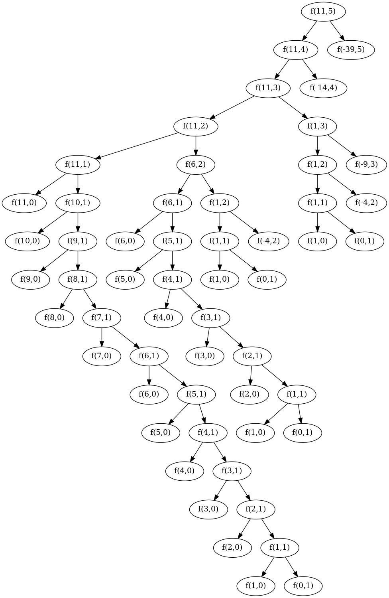

Question
========

Draw the tree illustrating the process generated by the `count-change` procedure
of Section 1.2.2 in making change for 11 cents. What are the orders of growth
of the space and number of steps used by this process as the amount to be changed
increases?

Solution
========

Mathematical definition
-----------------------

The following mathematical definition captures what `count-change` evaluates:

$$
    f(a, n) = 
    \begin{cases}
    1, & \text{if a = 0} \\
    0, & \text{if a < 0} \\
    0, & \text{if n < 0} \\
    f(a - d, n) + f(a, n - 1),& \text {otherwise} \\
   \end{cases}
$$

where $a$ is the amount, $n$ is the $n^{th}$ kind of coin and
$d$ the denomination of the $n^{th}$ kind of coin. The coins are assumed to be
in an increasing order of their denomination.

Order of Growth of the Number of Steps
-------------------------------------- 

The following diagram illustrates the process generated in making change for
11 cents.

In general, for sufficiently large values of the input $a$ which is also
significantly larger than the highest denomination coin, the number of nodes
at each level of the tree doubles as we traverse the tree from top to almost
the bottom of the tree. At some point we will arrive at an amount which is
less than or equal to the largest denomination, then the number of nodes in
successive levels decreases. The number of steps is proportional to the number
of tree nodes, which is $\Theta(2^a)$.

Order of Growth of the Space Requirement
----------------------------------------
From the diagram above, we can notice that the longest path in any subtree is 
when the process attempts to count the changes for the amount under consideration
by excluding the highest denomination coin from the remaining coins. Eventually,
it will arrive at a point where it has only one coin left, and the counting has
to be done in terms of it. 

In general, the space requirement is proportional to the height of the tree,
which is $\Theta(m + a/k)$, where $m$ is the number of coins and $k$ is the
amount of the smallest denomination coin.
